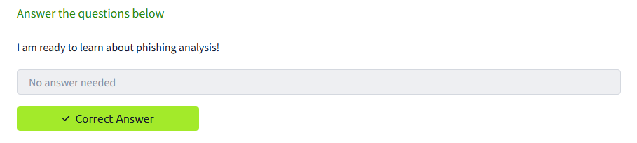
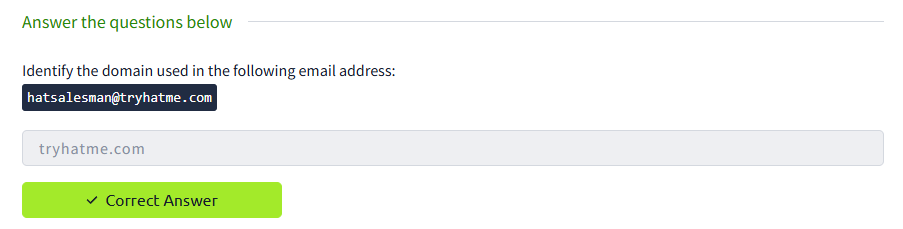
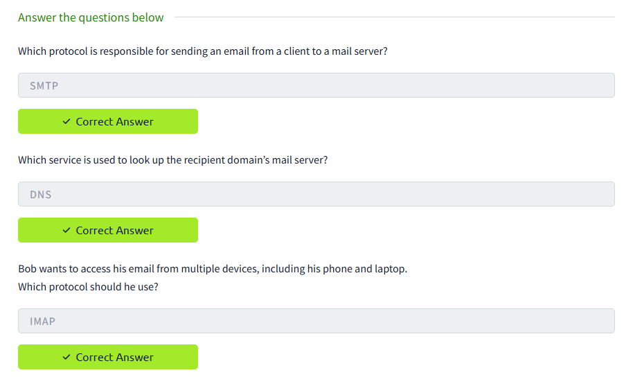
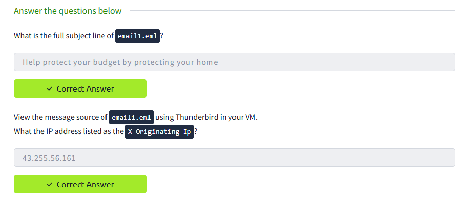
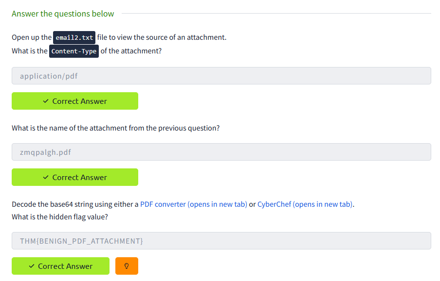
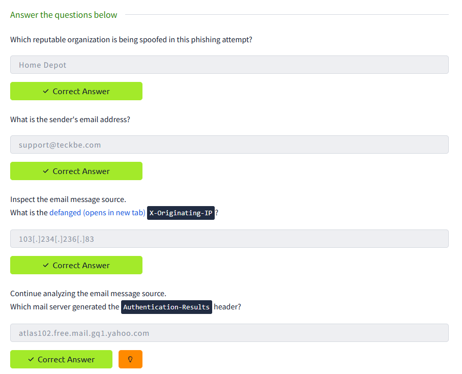
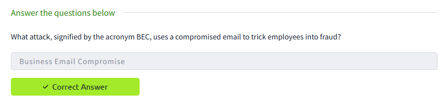

# TryHackMe: Phishing Analysis Fundamentals - Walkthrough & Write-up

## 📌 Room Overview
* **Room Name:** Phishing Analysis Fundamentals
* **Difficulty:** Easy
* **Category:** Security Operations (SOC Level 1) / Email Forensics
* **Objective:** Understand the core infrastructure of modern email communication, learn how to dissect raw email components, extract vital threat metadata from email headers, and analyze potentially dangerous attachments or body strings.

---

## 🔍 Task 1: Introduction
This room establishes the operational baseline required for defensive security analysts to triage suspicious email campaigns. Phishing remains one of the primary attack vectors for corporate breaches, meaning analysts must know how to inspect structural components without relying solely on automated security gateways.

*No questions are required for this task.*



---

## 📧 Task 2: The Email Address
This task covers the foundational structure of an email address, establishing the concept of user mailboxes and destination routing routing markers popularized by Ray Tomlinson on ARPANET.

### ❓ Questions & Answers
#### 1. Identify the domain used in the following email address:
hatsalesman@tryhatme.com
* **Answer:** `tryhatme.com`



---

## 🚚 Task 3: Email Delivery
An exploration of the core transmission layers utilized across the internet to transition raw messages from an origin agent to a destination system inbox.

### ⚙️ Protocols Reviewed:
* **SMTP (Simple Mail Transfer Protocol):** Handshakes and transfers outbound email.
* **POP3 (Post Office Protocol v3):** Downloads mail locally and typically flushes it from the server.
* **IMAP (Internet Message Access Protocol):** Caches and synchronizes email dynamically across endpoints.

### ❓ Questions & Answers
#### 1. Which protocol is responsible for sending an email from a client to a mail server?
* **Answer:** `SMTP`

#### 2. Which service is used to look up the recipient domain’s mail server?
* **Answer:** `DNS`

#### 3. Bob wants to access his email from multiple devices, including his phone and laptop. Which protocol should he use?
* **Answer:** `IMAP`



---

## 📑 Task 4: Email Headers
Email headers act as the data ledger of a message, logging every mail transfer agent (MTA) it touched, along with security authentication headers.

### 🔍 Key Forensic Structural Elements:
* `From:` The declared origin identity (frequently spoofed by adversaries).
* `Return-Path:` The real address where bounce-back error state notifications route.
* `X-Originating-IP:` The client system IP that sent the email to the first server.

### ❓ Questions & Answers
#### 1. What is the full subject line of email1.eml?
* **Answer:** `Help protect your budget by protecting your home`

#### 2. View the message source of email1.eml using Thunderbird in your VM. What the IP address listed as the X-Originating-Ip?
* **Answer:** `43.255.56.161`



---

## 🖥️ Task 5: Email Body
This module focuses on how complex attachment files and rich HTML components are wrapped inside an email via MIME boundaries and binary-to-text encoding structures.

### 🛠️ Step-by-Step Triage
Open `email2.txt` from the Desktop workspace. Scroll down past the primary text content until you find the raw segment defining the attachment parameters:

```text
Content-Type: application/pdf; name="Payment-updateid.pdf"
Content-Disposition: attachment; filename="Payment-updateid.pdf"
Content-Transfer-Encoding: base64
```

To extract the hidden flag string safely:
1. Highlight and copy the complete raw block of Base64 characters trailing that header block.
2. Paste the string directly into **CyberChef** within your analyst browser.
3. Apply the **"From Base64"** operation block. 
4. Use the **"Extract Strings"** function or download the recovered binary to capture the enclosed text data.

### ❓ Questions & Answers

#### 1. Open up the email2.txt file to view the source of an attachment. What is the Content-Type of the attachment?
* **Answer:** `application/pdf`

#### 2. What is the name of the attachment from the previous question?
* **Answer:** `Payment-updateid.pdf`

#### 3. Decode the base64 string using either a PDF converter or CyberChef. What is the hidden flag value?
* **Answer:** `THM{BENIGN_PDF_ATTACHMENT}`



---

## 🎣 Task 6: Types of Phishing
This section introduces standard social engineering taxonomies (Bulk Spam, MalSpam, Spear Phishing, Whaling, Smishing, Vishing) and provides a live malicious sample to dissect.

### 🔍 Malicious Email Identifiers
* **Psychological Trigger:** The subject line deploys immediate urgency ("Order Placed Successfully") to cause confusion and prompt a quick click.
* **Brand Incongruity:** The context of the body content mimics a reputable consumer provider, yet the actual underlying sending domain metadata (`teckbe.com`) has zero legitimate ties to that brand.

### ❓ Questions & Answers

#### 1. What trusted entity is this email masquerading as?
* **Answer:** `Home Depot`

#### 2. What is the sender's email?
* **Answer:** `support@teckbe.com`

#### 3. Inspect the email message source. What is the defanged (opens in new tab) X-Originating-IP?
* **Answer:** `103[.]234[.]236[.]83`

#### 4. Continue analyzing the email message source. Which mail server generated the Authentication-Results header?
* **Answer:** `atlas102.free.mail.gq1.yahoo.com`



---

## 🏁 Task 7: Conclusion
The final module highlights corporate threat matrices like Business Email Compromise (BEC), where threat actors spoof executive identities or compromise supplier infrastructure to orchestrate fraudulent invoice routing or asset wire actions.

### ❓ Questions & Answers

#### 1. What is BEC?
* **Answer:** `Business Email Compromise`



---
*Walkthrough finished successfully! Feel free to star this repository if it helped streamline your learning path.*
